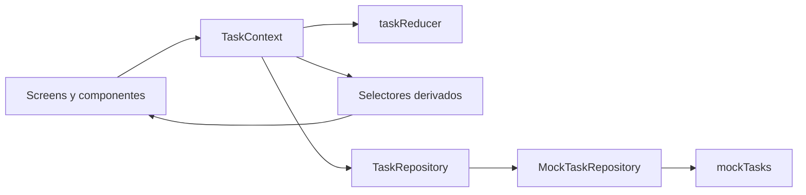

# Real Plaza Tasks

MVP de un panel móvil de tareas desarrollado para el challenge técnico de React Native. `main` conserva la entrega de solo lectura; `feature/plus` agrega búsqueda, ordenamiento y edición local sobre los mismos datos mock.

> Proyecto demostrativo. No utiliza datos, servicios, logotipos ni activos oficiales de Real Plaza.

## Inicio rápido

### iOS — plataforma principal validada

Requiere macOS, Xcode 16.3 o compatible, un runtime de iOS instalado y CocoaPods.

```bash
npm install
bundle install
npm run ios:pods
```

En una terminal, iniciar Metro:

```bash
npm start
```

En otra terminal, ejecutar el simulador:

```bash
npm run ios
```

### Android — mismo repositorio

Requiere JDK 17, Android Studio/SDK y un emulador o dispositivo iniciado.

```bash
npm install
npm start
```

En otra terminal:

```bash
npm run android
```

Para compilar el APK debug sin abrir el emulador:

```bash
npm run android:build
```

En iOS se debe abrir `ios/RealPlazaTasks.xcworkspace`, nunca el `.xcodeproj`, después de instalar Pods.

## Alcance

- 12 tareas mock que cubren todos los estados y prioridades requeridos.
- Filtros combinables por estado y prioridad.
- Detalle completo de una tarea.
- Estadísticas por estado y prioridad, dibujadas con componentes nativos.
- Estados explícitos de carga, error y vacío tanto en la lista como en Estadísticas, además de filtros sin resultados.
- Escenarios de demostración para `normal`, `carga`, `vacío` y `error` disponibles en builds de desarrollo.
- Modo claro/oscuro y adaptación al tamaño de texto del sistema.

No incluye backend, autenticación, múltiples usuarios ni CRUD porque el brief los deja fuera de alcance. En particular, la app no permite agregar tareas.

### Rama `feature/plus`

Esta rama agrega búsqueda combinable por título, área o responsable, ordenamiento por estado o prioridad en ambas direcciones y edición local. Se pueden modificar título, descripción, área, responsable, estado y prioridad. Las fechas se mantienen sin cambios y todo el estado continúa siendo local y en memoria.

## Requisitos

- Node.js 20 o superior.
- npm.
- Watchman recomendado en macOS.
- Android: JDK 17, Android Studio/SDK y un emulador o dispositivo.
- iOS: macOS, Xcode 16.3 o compatible y un runtime de iOS instalado.

La versión de React Native está fijada en `0.83.1`. `react-native-screens` está fijado exactamente en `4.25.0` porque versiones 4.26+ requieren React Native 0.84+.

## Instalación

```bash
npm install
bundle install
cd ios
LANG=en_US.UTF-8 LC_ALL=en_US.UTF-8 bundle exec pod install
cd ..
```

`nkf` está declarado en el `Gemfile` para que CocoaPods funcione también con Ruby 4, donde `kconv` dejó de formar parte de las gemas por defecto.

## Ejecución

Primero iniciar Metro:

```bash
npm start
```

En otra terminal:

```bash
npm run ios
# o
npm run android
```

En iOS abrir siempre `ios/RealPlazaTasks.xcworkspace`, no el `.xcodeproj`, después de instalar Pods.

### Estado real de validación

- Android: APK debug compilado y MVP ejecutado en emulador ARM64 Android 35. Se verificaron lista, filtros, detalle, estadísticas, carga, error, vacío, sin resultados, modo oscuro y escala de fuente 1.3.
- iOS: compilado y ejecutado en iPhone 16 Pro Simulator con iOS 18.4 y Xcode 16.3. Se verificaron lista, filtros combinados, detalle, Back nativo, estadísticas, carga, error, vacío, sin resultados, modo oscuro y Dynamic Type.

La app sigue la apariencia del sistema. Para revisar el modo oscuro en iOS, activar `Settings > Display & Brightness > Dark` dentro del simulador; no requiere una configuración propia de la app.

El ajuste de inset bajo el `large title` de iOS fue corregido con el comportamiento automático del `FlatList` y validado nuevamente desde un lanzamiento limpio. El contador, el resumen, los filtros y la lista quedan visibles desde la primera vista.

En builds de desarrollo, **Probar estados de la interfaz** permite reproducir los escenarios normal, carga persistente, vacío y error. La carga normal también aparece durante la latencia simulada. Este control no se incluye en Release porque está protegido por `__DEV__`.

### Reproducir los estados simulados

Con el dataset normal de 12 tareas, error y vacío no ocurren espontáneamente. Se incluyen como respuestas configurables del repositorio mock para demostrar cómo reaccionaría la interfaz ante una futura API.

1. Ejecutar la app con `npm run ios` o `npm run android`; ambos comandos generan una build Debug.
2. Abrir **Probar estados de la interfaz** en la pantalla de tareas.
3. Elegir el escenario.
4. Para revisar su variante de Estadísticas, abrir **Estadísticas** sin cambiar el escenario.

| Escenario | Respuesta simulada | Resultado visible |
| --- | --- | --- |
| Normal | 12 tareas después de la latencia | Lista y estadísticas completas |
| Carga | Promesa deliberadamente pendiente | Esqueletos persistentes para inspección |
| Vacío | Respuesta exitosa con `[]` | Empty state, no estadísticas en cero |
| Error | Promesa rechazada | Mensaje recuperable y acción de reintento |

Mientras **Vacío** o **Error** permanezcan seleccionados, volver a cargar o reintentar reproduce la misma respuesta. Seleccionar **Normal** restaura el flujo exitoso. En Release no se exponen controles para provocar estados artificiales; la lógica de presentación permanece preparada para respuestas reales del repositorio.

## Calidad

```bash
npx tsc --noEmit
npm run lint
npm test -- --runInBand
cd android && ./gradlew assembleDebug
```

Las 23 pruebas Jest cubren repositorio mock, reducer, filtros, búsqueda, ordenamiento estable, edición local, estadísticas, sus estados de carga/error/vacío y la composición principal de proveedores y navegación.

## Arquitectura



```text
src/
├── app/navigation          # stack y contratos de rutas
├── features/tasks
│   ├── domain              # Task y TaskRepository
│   ├── data                # mocks y repositorio local
│   ├── state               # reducer, contexto y selectores
│   ├── components          # piezas visuales reutilizables
│   └── screens             # lista, detalle y estadísticas
└── shared                  # tema y utilidades transversales
```

`Context + useReducer` mantiene explícitos los eventos de un único dominio sin incorporar el coste de una librería global. `TaskRepository` separa la fuente de datos mock de la interfaz y permite ampliar el flujo local sin acoplarlo a las pantallas. Filtros y estadísticas son datos derivados para evitar sincronización y duplicación de estado.

## Modelo mock

El modelo mínimo se extendió con:

- `area`: aporta contexto operativo al listado y detalle.
- `assignee`: permite identificar responsabilidad sin introducir múltiples sesiones de usuario.
- `dueAt`: diferencia vencimiento de `createdAt` y permite una lectura temporal útil.

Las fechas se almacenan como ISO 8601 y se formatean en la UI. La combinación `completed + high` se deja deliberadamente sin datos para que el estado requerido de filtro sin resultados sea reproducible; aun así, el conjunto cubre por separado todos los estados y prioridades pedidos.

## Documentación

- [Decisiones de arquitectura](docs/architecture-decisions.md)
- [Bitácora del challenge](docs/challenge-log.md)
- [Defensa para entrevista](docs/interview-defense.md)
- [Producto](PRODUCT.md)
- [Sistema de diseño](DESIGN.md)
- Skill local para ampliaciones: `.agents/skills/extend-real-plaza-tasks/SKILL.md`
- [Guía de `feature/plus`](docs/feature-plus-guide.md)

## Uso de IA

Se utilizó IA como apoyo para analizar el brief, explorar direcciones visuales, implementar, crear pruebas, revisar y documentar. Las pruebas asistidas por IA se revisaron manualmente para comprobar que validaran comportamientos relevantes, se ejecutaron localmente y se contrastaron con recorridos funcionales en el simulador. La IA no reemplaza la responsabilidad técnica: cada elección debe poder explicarse, reproducirse y modificarse desde el código.
