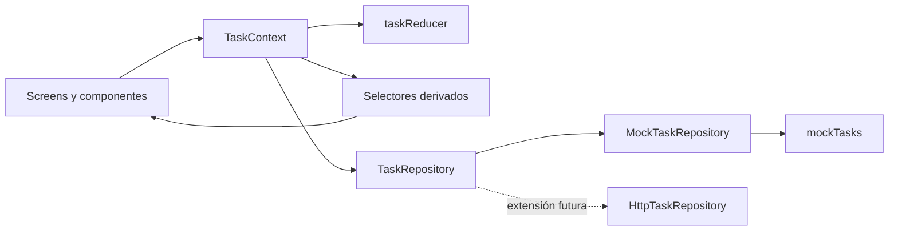

# Real Plaza Tasks

MVP de un panel móvil de tareas desarrollado para el challenge técnico de React Native. La app es de solo lectura: permite listar, filtrar, consultar detalle y visualizar estadísticas usando datos locales con latencia simulada.

> Proyecto demostrativo. No utiliza datos, servicios, logotipos ni activos oficiales de Real Plaza.

## Alcance

- 12 tareas mock que cubren todos los estados y prioridades requeridos.
- Filtros combinables por estado y prioridad.
- Detalle completo de una tarea.
- Estadísticas por estado y prioridad, dibujadas con componentes nativos.
- Estados explícitos de carga, error, lista vacía y filtros sin resultados.
- Escenarios de demostración para `normal`, `vacío` y `error` disponibles en builds de desarrollo.
- Modo claro/oscuro y adaptación al tamaño de texto del sistema.

No incluye backend, autenticación, múltiples usuarios ni CRUD porque el brief los deja fuera de alcance. En particular, la app no permite agregar tareas.

## Requisitos

- Node.js 20 o superior.
- npm.
- Watchman recomendado en macOS.
- Android: JDK 17, Android Studio/SDK y un emulador o dispositivo.
- iOS: macOS, Xcode 16.3 o compatible y un runtime de iOS instalado.

La versión de React Native está fijada en `0.83.1`. `react-native-screens` está fijado exactamente en `4.25.0` porque versiones 4.26+ requieren React Native 0.84+.

## Instalación

```bash
npm install
bundle install
cd ios
LANG=en_US.UTF-8 LC_ALL=en_US.UTF-8 bundle exec pod install
cd ..
```

`nkf` está declarado en el `Gemfile` para que CocoaPods funcione también con Ruby 4, donde `kconv` dejó de formar parte de las gemas por defecto.

## Ejecución

Primero iniciar Metro:

```bash
npm start
```

En otra terminal:

```bash
npm run ios
# o
npm run android
```

En iOS abrir siempre `ios/RealPlazaTasks.xcworkspace`, no el `.xcodeproj`, después de instalar Pods.

### Estado real de validación

- Android: APK debug compilado y MVP ejecutado en emulador ARM64 Android 35. Se verificaron lista, filtros, detalle, estadísticas, carga, error, vacío, sin resultados, modo oscuro y escala de fuente 1.3.
- iOS: dependencias CocoaPods y codegen instalados correctamente con Xcode 16.3. La compilación/ejecución queda pendiente hasta que termine de instalarse el runtime iOS 18.4 en esta Mac. No se declara validación visual iOS sin esa evidencia.

## Calidad

```bash
npx tsc --noEmit
npm run lint
npm test -- --runInBand
cd android && ./gradlew assembleDebug
```

Las 13 pruebas Jest cubren repositorio mock, reducer, filtros, búsqueda por id, estadísticas, estados de pantalla y la composición principal de proveedores y navegación.

## Arquitectura



```text
src/
├── app/navigation          # stack y contratos de rutas
├── features/tasks
│   ├── domain              # Task y TaskRepository
│   ├── data                # mocks y repositorio local
│   ├── state               # reducer, contexto y selectores
│   ├── components          # piezas visuales reutilizables
│   └── screens             # lista, detalle y estadísticas
└── shared                  # tema y utilidades transversales
```

`Context + useReducer` mantiene explícitos los eventos de un único dominio sin incorporar el coste de una librería global. `TaskRepository` separa la fuente de datos de la interfaz; reemplazar el mock por HTTP no requiere cambiar pantallas. Filtros y estadísticas son datos derivados para evitar sincronización y duplicación de estado.

## Modelo mock

El modelo mínimo se extendió con:

- `area`: aporta contexto operativo al listado y detalle.
- `assignee`: permite identificar responsabilidad sin introducir múltiples sesiones de usuario.
- `dueAt`: diferencia vencimiento de `createdAt` y permite una lectura temporal útil.

Las fechas se almacenan como ISO 8601 y se formatean en la UI. La combinación `completed + high` se deja deliberadamente sin datos para que el estado requerido de filtro sin resultados sea reproducible; aun así, el conjunto cubre por separado todos los estados y prioridades pedidos.

## Documentación

- [Decisiones de arquitectura](docs/architecture-decisions.md)
- [Bitácora del challenge](docs/challenge-log.md)
- [Defensa para entrevista](docs/interview-defense.md)
- [Producto](PRODUCT.md)
- [Sistema de diseño](DESIGN.md)
- Skill local para ampliaciones: `.agents/skills/extend-real-plaza-tasks/SKILL.md`

## Uso de IA

Se utilizó IA como apoyo para analizar el brief, explorar direcciones visuales, implementar, revisar y documentar. Las decisiones se conservan en la bitácora y se validan mediante tipos, pruebas y builds nativos. La IA no reemplaza la responsabilidad técnica: cada elección debe poder explicarse, reproducirse y modificarse desde el código.
